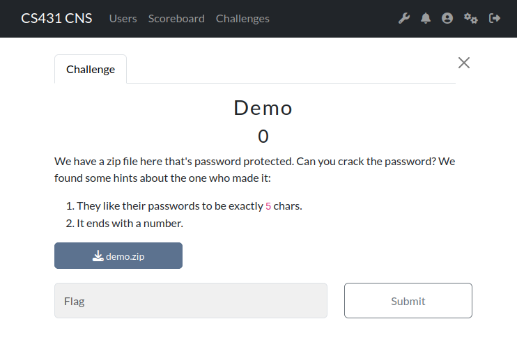
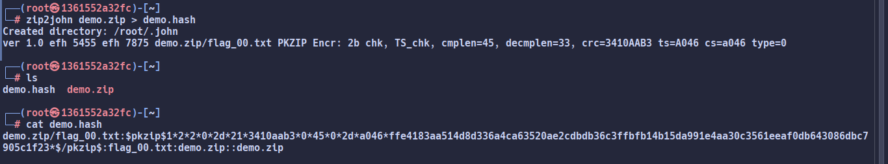
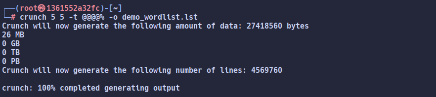
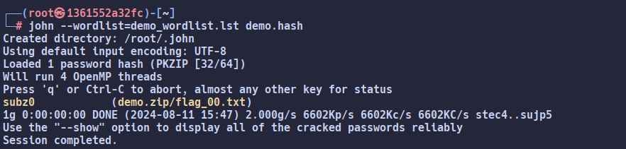
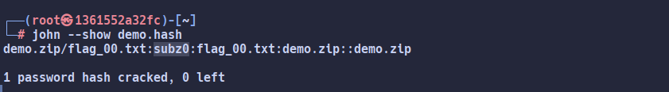
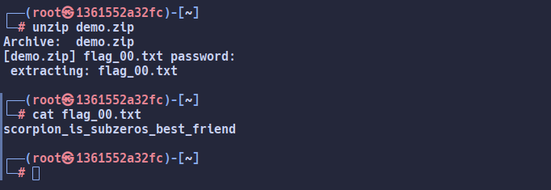
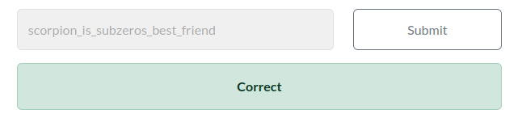

# Setting Up
## Docker
### Windows:
1. [Download](https://desktop.docker.com/win/main/amd64/Docker%20Desktop%20Installer.exe?utm_source=docker&utm_medium=webreferral&utm_campaign=docs-driven-download-win-amd64) Docker Installer.
2. Install.
3. If you have errors updating WSL, run `wsl --update`.
4. Verify by running `docker --version` in the terminal.

### Linux:
1. `apt update && apt install docker` or similar for your distro/package manager.
2. Add user to docker group using `groupadd -f docker && usermod -aG docker $USER`.
3. Restart.
4. Verify by running `docker --version` in the terminal.

### MacOS:
1. Download Docker Installer. [ARM](https://desktop.docker.com/mac/main/arm64/Docker.dmg?utm_source=docker&utm_medium=webreferral&utm_campaign=docs-driven-download-mac-arm64) [Intel](https://desktop.docker.com/mac/main/amd64/Docker.dmg?utm_source=docker&utm_medium=webreferral&utm_campaign=docs-driven-download-mac-amd64)
2. Install.
3. Verify by running `docker --version` in the terminal.

## Kali/ParrotOS Image
1. `docker run -it --name kali kalilinux/kali-rolling`  

2. Now you'll be running commands inside the container.
3. Run `apt update` repeatedly until you get no errors. (There's some problem with the server's certificates with right now)
4. Run `apt install john crunch`  

5. You can restart where you left if you close your terminal by running `docker start -i kali`  

# Download the challenge files to your container
1. Open terminal where the files are downloaded.  

2. Run this on the host terminal `docker cp ./<file> kali:/root`  

3. File will now be in `/root` directory of the container.  

# Solving a demo challenge
1. The text for a challenge looks like this:  

2. Download and copy the file to the container.
3. Convert the zip to a format `john` can work on using `zip2john`.  
Usage: `zip2john <file>.zip > <file>.hash`.  

4. You'll work on the `.hash` file now.
5. Create a wordlist based on the challenge text using `crunch`.  
Usage: `crunch <min_chars> <max_chars> -t <pattern> -o <out file>`  

6. Use the wordlist with `john`.  
Usage: `john --wordlist=<wordlist> <hash file>`  

7. If `john` succeeds in cracking, you'll see the message.  
Else, create and try another wordlist.
8. When `john` finds the password, see it using `john --show <hash file>`  

9. Unzip and read the file using the password.  
To do it in the terminal you can use `unzip <zip file>`.  
(May need to install `unzip`)  

10. Submit the flag.  

## NOTES
11. There may be cases where `crunch` will generate very big (multi GB) wordlists.  
Use `Control+C` to cancel the operation before it crashes/fills up disk on your system.  
It shows you the size of the wordlist for 3 seconds before generating them.
12. If the password is simple enough (~6-7 chars), you may get away without creating a wordlist.  
Just use `john <hash file>` to make it try all combinations. This is very inefficient, use it wisely.

# Resources
This is a minimal list to get you started. You are expected to search the web for more resources.
- [Crunch Manpage](https://manpages.ubuntu.com/manpages/oracular/en/man1/crunch.1.html)
- [Stackoverflow with Crunch usage examples](https://superuser.com/questions/1465287/crunch-d-option-with-simple-aa-charset)
- [How to use John the ripper for password rules](https://charlesreid1.com/wiki/John_the_Ripper/Password_Generation)
- [List of packages that may help](https://www.kali.org/tools/kali-meta/#kali-tools-passwords)
