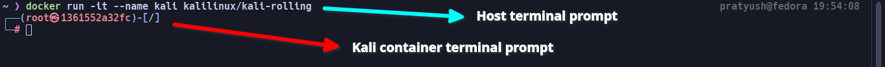
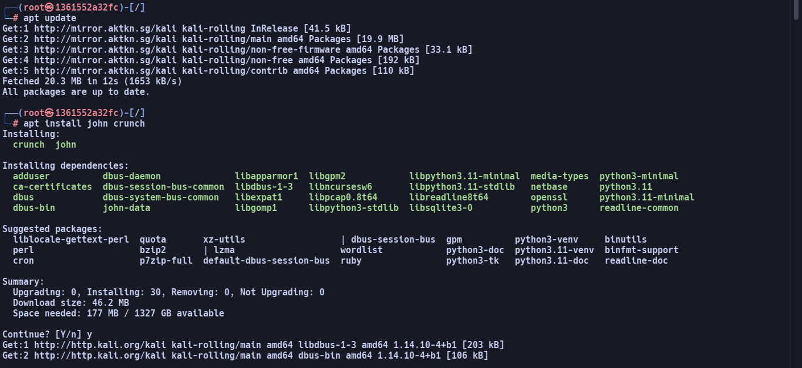
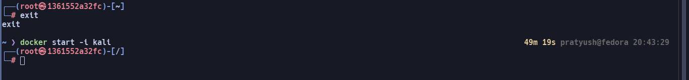

# Setting Up
## Docker
### Windows:
1. [Download](https://desktop.docker.com/win/main/amd64/Docker%20Desktop%20Installer.exe?utm_source=docker&utm_medium=webreferral&utm_campaign=docs-driven-download-win-amd64) Docker Installer.
2. Install.
3. If you have errors updating WSL, run `wsl --update`.
4. Verify by running `docker --version` in the terminal.

### Linux:
1. `apt update && apt install docker` or similar for your distro/package manager.
2. Add user to docker group using `groupadd -f docker && usermod -aG docker $USER`.
3. Restart.
4. Verify by running `docker --version` in the terminal.

### MacOS:
1. Download Docker Installer. [ARM](https://desktop.docker.com/mac/main/arm64/Docker.dmg?utm_source=docker&utm_medium=webreferral&utm_campaign=docs-driven-download-mac-arm64) [Intel](https://desktop.docker.com/mac/main/amd64/Docker.dmg?utm_source=docker&utm_medium=webreferral&utm_campaign=docs-driven-download-mac-amd64)
2. Install.
3. Verify by running `docker --version` in the terminal.

## Kali/ParrotOS Image
1. `docker run -it --name kali kalilinux/kali-rolling`  

2. Now you'll be running commands inside the container.
3. Run `apt update` repeatedly until you get no errors. (There's some problem with the server's certificates with right now)
4. Run `apt install john crunch`  

5. You can restart where you left if you close your terminal by running `docker start -i kali`  

Alternatively, if Kali is not working, you can use `docker run -it --name parrot parrotsec/security`, and `docker start -i parrot`.
